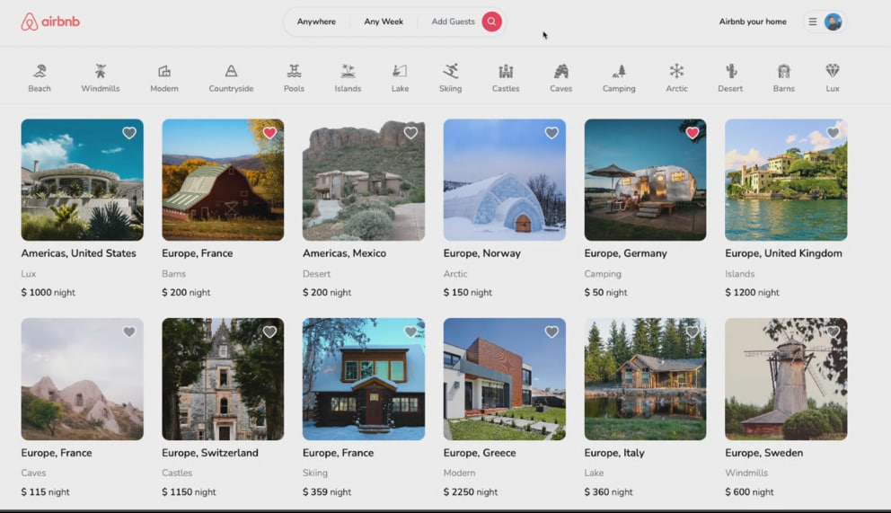

# Project Airbnb 

<h3>Использованные техналоги</h3>
<ul>
    <li>react js</li>
    <li>next js</li>
    <li>prisma</li>
    <li>typescript</li>
    <li>tailwind</li>
    <li>react-hook-form</li>
    <li>cloudinary</li>
</ul>

## Устанавливаем зависимости
npm install && yarn install

## Завпускаем в dev режим 
npm start && yarn start 
